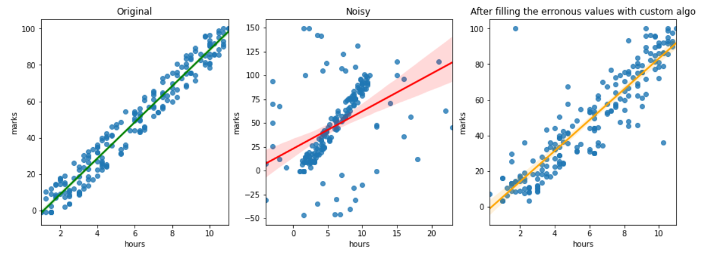

# COTW 8 🎉🎉🎉🎉🎉🎉🎉🎉

# Solution for [8th Challenge of the Week](https://aistudent.community/single_event/71) by [AISC](https://aistudent.community/)

## Soluiton by [Yash Pawar](https://github.com/yashppawar)

In this [notebook](./cotw-8-yashppawar.ipynb), we went from makeing the original data, adding noise to it (using random) and cleaning the created noise, the 3rd graph is the graph of cleaned data, the 2nd graph is of the data with Noise added.

# Thank you AISC, CBSE and Intel for this challenge 👏
#Intel.AI4Youth #AISC #AI
